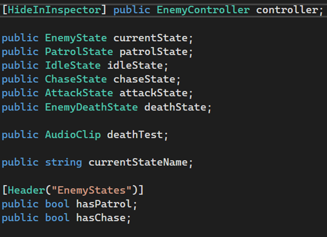
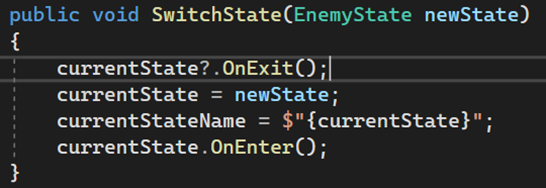
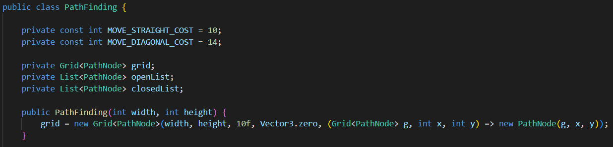
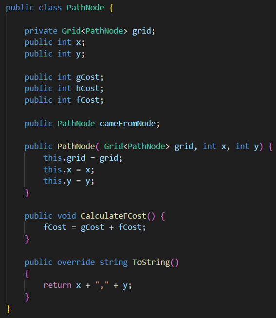
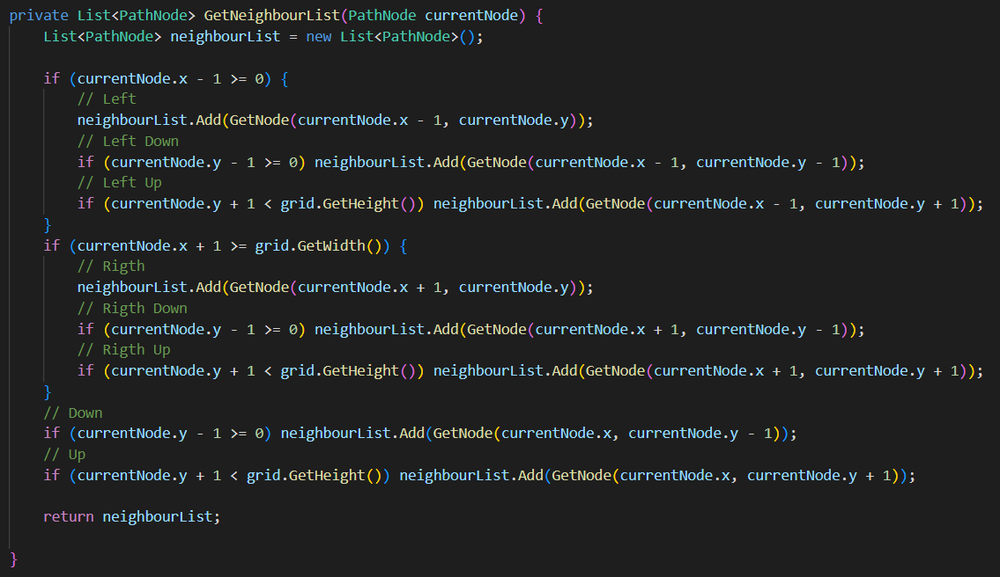
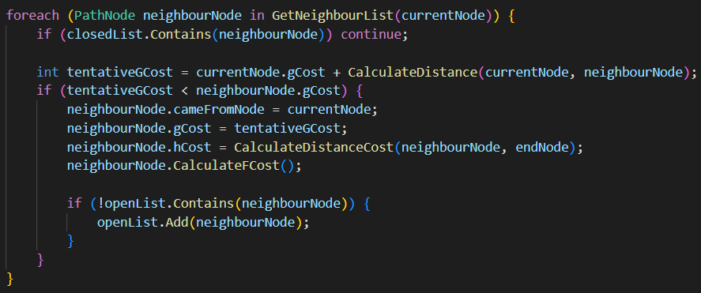
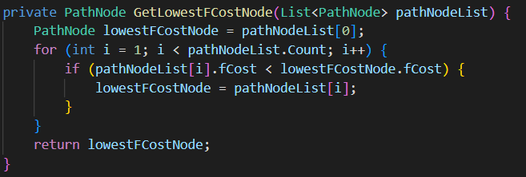

# Projeto-Aplicado

## Técnicas de Inteligência Artificial Utilizadas

### Enemy State Machine

A Enemy State Machine é uma Máquina de Estados utilizada para a fácil compreensão do que os inimigos estão a realizar, definindo em que estado está, existindo cinco Estados para cada inimigo, mas também sabendo que pode haver o caso de um inimigo não possuir um Estado devido ao Design do Tal:

* Patrol State: O Estado usado pelos Inimigos que permace como um método de Vigia, neste Estado o Inimigo não ataca ninguém e estará só em modo de Vigia procurando pelo Jogador a cada momento.
* Idle State: O Estado usado pelos Inimigos quando estão parados, usado também para quando o Inimigo está a mudar de Estado, pois existem sempre uns pequenos milissegundos entre o Inimigo trocar de Patrol para Chase, ou vice-versa.
* Chase State: O Estado que define a perseguição entre o Inimigo e o Jogador, neste Estado o Objetivo do Inimigo é atacar o Jogador, que no caso de o fazer muda para o Attack State.
* Attack State: O Estado de Ataque entre o Inimigo e o Jogador.
* Enemy Death State: O Estado atribuído no momento de morte de cada Inimigo.

Esta Máquina de Estados ajuda o nosso Jogo a Ordenar o que cada um dos Inimigos está a fazer, para que em qualquer momento que for necessário ser visto para realizar as partes que necessitam desta Máquina de Estados.

Temos também a opção de guardar se o inimigo tem patrol ou chase state, pois pode ser que não tenha, pois devido ao Design de Cada Inimigo ele pode ser somente Patrol ou somente Chase, por isso temos a necessidade de implementar essa condição para a nossa Máquina de Estados.

No nosso jogo a vida dos inimigos e do jogador é tempo, e diminui constantemente, por isso caso o inimigo chegue a 0 de vida, o state dele passa a ser o DeathState.

A função que troca cada estado, quando não houver nenhum estado ativo a state machine mete o IdleState por norma, isto pelo o facto de que o Idle State é o Estado que o Inimigo usa para mover-se de Estado em Estado, pois em qualquer transição existe um pequeno momento em que Inimigo tende a parar.

Os inimigos que têm patrol state estão com esse state ativo por norma, caso o inimigo possua chase state e o player entre no seu campo de visão, o state passa a ser o chase state

Caso o inimigo esteja em idle state este troca para chase state da mesma forma, e caso o inimigo tenha patrol state, este automaticamente passa de idle para patrol state.

E durante o chase state, caso o inimigo perca o jogador do seu campo de visão, ele volta para o idle state.

### Dugeon Generator

### Pathfinding A*

Para o pathfinding dos inimigos usamos o A*, no caso este método não está implementado no jogo devido a problemas na implementação, mas conseguimos realizar o Código necessário para a realização do tal.

Começamos por dar uma posição inicial, (posição do inimigo), e uma posição final, (posição do player), em seguida criamos uma open list e uma closed list, ambas vazias, e damos à open list a posição do player como primeiro elemento, já que os elementos da open list são os que estão em fila para serem testados e os da closed list são aqueles que já foram testados.

Nós usamos dois tipos de custos, o custo A é o custo de se deslocar de um node para o outro, o custo B que é custo necessário para alcançar o node final, e o custo C, que é a soma do custo A e do custo B.

Seguidamente utilizamos uma função para criar uma lista de Nodes que contêm todos os Nodes que estão à volta do Node onde atualmente estamos.

Com isso o Pathfinding encontra o valor menor entre os Costs de todos os Nodes para então fazer o Inimigo mover, vendo sempre se o Node já está na Lista dos Fechados, pois se tivesse o Node não poderia ser repetido.

Com isso escolhe-se o menor Cost pertencente aos Nodes adjacentes ao Node onde o Inimigo está para então escolher esse para fazer o Inimigo mover-se.

