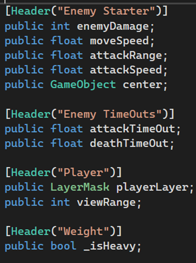

# Projeto-Aplicado

## Técnicas de Inteligência Artificial Utilizadas

### Enemy State Machine

No nosso jogo, utilizamos uma Enemy State Machine para ordenar os estados que cada inimigo possui.

O Enemy Controller é usado para armazenar os dados dos inimigos, como a sua velocidade e dano por exemplo.

Temos também a opção de guardar se o inimigo tem patrol ou chase state, pois pode ser que não tenha.

No nosso jogo a vida dos inimigos e do jogador é tempo, e está constantemente a diminuir, por isso caso o inimigo chegue a 0 de vida, o state dele passa a ser o deathState.

A função que troca cada estado, quando não houver nenhum estado ativo a state machine mete o idleState por norma.

Os inimigos que têm patrol state estão com esse state ativo por norma, caso o inimigo possua chase state e o player entre no seu campo de visão, o state passa a ser o chase state

Caso o inimigo esteja em idle state este troca para chase state da mesma forma, e caso o inimigo tenha patrol state, este automaticamente passa de idle para patrol state.

E durante o chase state, caso o inimigo perca o jogador do seu campo de visão, ele volta para o idle state.

### Dugeon Generator

### Pathfinding A*

Para o pathfinding dos inimigos usamos o A*.

Começamos por dar uma posição inicial, (posição do inimigo), e uma posição final, (posição do player), em seguida criamos uma open list e uma closed list, ambas vazias, e damos à open list a posição do player como primeiro elemento, já que os elementos da open list são os que estão em fila para serem testados e os da closed list são aqueles que já foram testados.

Nós usamos dois tipos de custos, o custo A é o custo de se deslocar de um node para o outro, o custo B que é custo necessário para alcançar o node final, e o custo C, que é a soma do custo A e do custo B.

Em seguida, passamos por todos os nodes e alteramos os custos A para infinito e calculamos o custo C.

E para inicializar a lista, identificamos que o node anterior é igual a “null”
